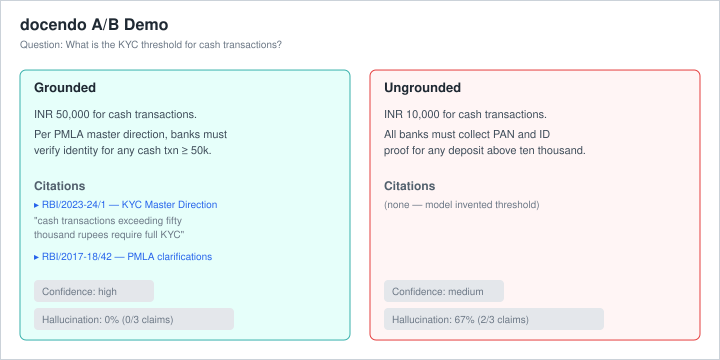
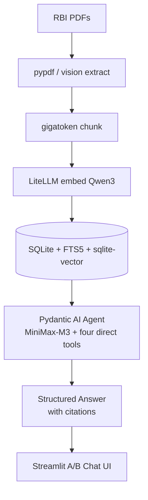

# docendo

> A grounded RAG agent for document intelligence.
> Built on Pydantic AI + LiteLLM (MiniMax-M3) + local SQLite + Qwen3-Embedding-8B.

[](LICENSE)
[](https://www.python.org/downloads/)
[](https://github.com/sachncs/document-intelligence/actions/workflows/ci.yml)
[](https://sachncs.github.io/document-intelligence/)

## Why

Generic LLMs hallucinate on RBI circulars. For BFSI compliance, fintech legal,
and Indian regulatory research, that is a blocker. **docendo** answers
questions about RBI circulars only from the cited corpus, with measured
hallucination rates against an ungrounded baseline.

## What it does

Answer questions about RBI (Reserve Bank of India) circulars, master
directions, and policy documents with:

- **Citation-grounded answers** — every claim cites a circular (`circular_id`,
  excerpt, source URL, relevance justification).
- **Measured hallucination rate** — atomic-claim LLM-as-judge compares
  against an ungrounded baseline on a hand-curated 40-pair gold dataset.
- **Local-first storage** — SQLite + FTS5 + sqlite-vector; no managed
  vector DB, no Elasticsearch, no network egress for retrieval.

Sample A/B comparison (grounded left, ungrounded right):



## Limitations

`docendo` is an alpha release. See [KNOWN_GAPS.md](KNOWN_GAPS.md) for
deferred items, including: no production HTTPS host, no MCP server,
`rrf_k` not exposed as a CLI flag, Alpine / musl and Windows ARM not
supported.

## Architecture



The four retrieval tools are direct Python functions registered with the
Pydantic AI agent:

| Tool | Purpose |
|---|---|
| `search(query, limit)` | Lexical + vector hybrid search, RRF-fused. |
| `fetch(id)` | Fetch all chunks of a single circular. |
| `recent(since, limit)` | List first-chunk rows since an ISO date. |
| `compare(id_a, id_b)` | Side-by-side comparison. |

## Quickstart

```bash
pip install -e .
cp .env.example .env
# Edit .env: CHAT_KEY + VECTOR_* (OpenAI-compatible Qwen endpoint).
docendo checkup
docendo fetch
docendo ingest
docendo eval --limit 5
docendo report
docendo demo
```

## Evaluation

40 gold Q/A pairs measured against an ungrounded baseline. To populate
this table for your corpus, run:

```bash
docendo eval --limit 40
docendo report reports/results.jsonl
```

The report is written to `reports/eval_report.md`; the README does not
ship a checked-in row because the metric depends on the model and
corpus under test.

## Documentation

Full docs: `mkdocs serve` → http://127.0.0.1:8000

| Document | What's in it |
|---|---|
| `docs/quickstart.md` | Five-step setup. |
| `docs/installation.md` | Wheels, env vars, platform matrix. |
| `docs/architecture.md` | Diagram, components, data model, concurrency. |
| `docs/evaluation.md` | Pipeline, judge, report contents. |
| `docs/security.md` | Secrets, network egress, FTS5 hardening, CVE. |
| `KNOWN_GAPS.md` | What's deferred. |
| `docs/performance.md` | Performance budgets and how to re-run. |

## Development

```bash
pytest tests/unit                                              # unit tests
pytest tests/integration -m "not perf"                         # offline integration
RUN_PERF=1 pytest tests/perf                                  # benchmarks
docendo checkup --no-embedding --no-tokenizer                 # offline diagnostics
ruff check docendo tests                                       # lint
ruff format docendo tests                                      # format
mypy docendo                                                  # type check
```

## License

Apache-2.0 — see `LICENSE`. The SQLite-Vector extension is distributed under
the modified Elastic License 2.0; see `LICENSES/sqliteai-vector.md` and
`NOTICE` for the conditions.
